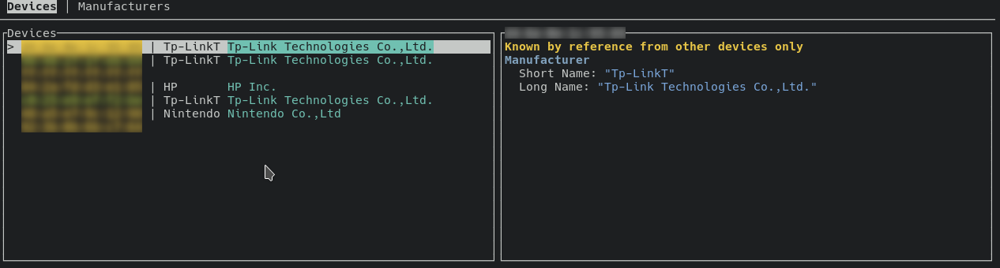

# Blockade Recon
A sequel to [Blockade Recon](https://github.com/cassa/blockade-recon). A tool for capturing and analysing wireless network traffic.



# Goals
- Tally devices by manufacturer
- Collect as much information as possible
- Save sessions
- Analyse and map probable device connections
- Basic demonstartions of 802.11 attacks
- Attempt mapping devices in space using multiple devices

# Installing

```sh
$ cargo install --git https://github.com/AidoP/blockade-recon
```

## Dependencies
- libpcap
- Cargo and Rust

# Usage

```sh
$ blockade-recon --help
$ blockade-recon -i
```

# Troubleshooting

### The device cannot start in monitor mode or no packets received
If libpcap cannot put your device into monitor mode succesfully, try using airmon-ng. Use the `-m` flag to not use libpcap's monitor mode functionality.
```sh
$ airmong-ng check kill
$ airmon-ng start <interface>
$ blockade-recon -im
```

### Packets are 5GHz / 2GHz only
Ensure you are not using the device for anything else. Disconnect from wifi networks and disable all processes which may try to use the device.
While in use by another process the wireless card may be tuned to a particular frequency / channel, making many packets uncapturable.

### The program crashes with <ERROR>
Try to understand the error. Check the source code, starting at the given line. If you need help, feel free to contact me. If you believe the error is caused by a problem in blockade-recon leave an issue.